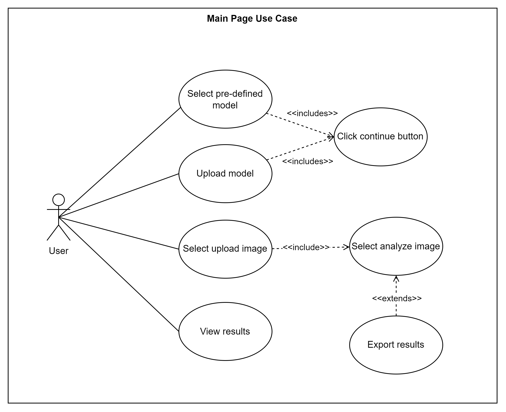

# LSC Inspector API - Flask
by **Team 2324-softeng2-sem1-f1-08** of CIT-U composed of:
- Acojedo, Jhonray
- Labajo, Kerr
- Leonor, Jie Ann
- Montayre, Queen Riza
- Yanson, Raul Jay

> This project was a compliance for the course **Software Engineering 2 Section F1** under the supervision of **Sir Ralph P. Laviste** during the First Semester of the Academic Year 2023-2024.

## Description

**Laser Soldering Condition Inspector (LSC Inspector)** is a project with the purpose of developing an automated system that can evaluate the quality of laser solder joint that is applied to a micro-component. The system will analyze images of solder joints and process it with machine learning to determine the quality of the solder joint. As for this repository, this serves as the backend of the project being run on Flask.

## Getting Started

### Prerequisites

- Python 3.10
- pip

### Installation

1. Clone the repository:
```sh
git clone https://github.com/Ra-Jay/flask_lsc_inspector.git
```

2. Navigate to the project directory:
```sh
cd flask_lsc_inspector
```

3. Install the required packages:
```sh
pip install -r requirements.txt
```

4. Set the environment variables:
```sh
cp .flaskenv.example .flaskenv
```
> You need to have a local MySQL server and database, Supabase account, and Roboflow account to get the necessary credentials for the environment variables.
>> [MySQL Setup](https://www.mysql.com/)
>> [Supabase Setup](https://supabase.io/)
>> [Roboflow Setup](https://roboflow.com/)

## Usage
```sh
flask run
or
python application.py
```

## Main Use Case
[](https://i.ibb.co/7Rz3z3V/Use-Case-Diagram.png)

### API Endpoints

#### Users
- `POST /api/v1/users/register` - Register a new user
- `POST /api/v1/users/login` - Login a user
- `GET /api/v1/users/token/refresh` - Refresh the JWT token
- `PUT /api/v1/users/<uuid>edit` - Update user details
- `PUT /api/v1/users/<uuid>/profile-image/edit` - Update user profile image
- `PUT /api/v1/users/<uuid>/password/edit` - Update user password

#### Files
- `POST /api/v1/files/upload` - Upload a file
- `POST /api/v1/files/analyze` - Analyze a file
- `POST /api/v1/files/demo` - Analyze a demo file
- `GET /api/v1/files/` - Get all user's files
- `GET /api/v1/files/<uuid>` - Get a user's file
- `DELETE /api/v1/files/<uuid>/delete` - Delete a user's file
- `DELETE /api/v1/files/clear` - Delete all user's files

#### Weights
- `POST /api/v1/weights/deploy` - Deploy a weight to Roboflow
- `GET /api/v1/weights/` - Get all user's weights
- `GET /api/v1/weights/<uuid>` - Get a user's weights
- `DELETE /api/v1/weights/<uuid>/delete` - Delete a user's weights

## Docker
A Dockerfile is included for building a Docker image of the application. To build and push the Docker image, use the provided `build_and_push.sh` script.

## Deployment
> The deployment of this application is not possible for some service providers in the internet due to its heavy Python packages, however, this was resolved by running this application in a virtual machine using Amazon Web Services (AWS) Elastic Computing Cloud (EC2) service to which hosts the API for the [NextJS Frontend Project](https://github.com/Ra-Jay/next_lsc_inspector) to consume.